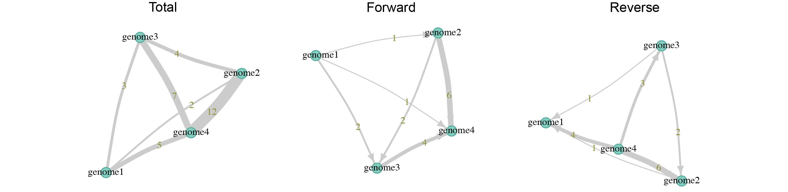

# MetaDEEP

MetaDEEP, the **Meta**bolic **D**ependence and **E**xchange **E**valuation **P**latform, is an R package to analyse metabolic dependence and exchange metrics from genome-scale metabolic networks (GSMN).

## Installation

MetaDEEP can be installed from this Github repository using devtools.

```r
install.packages("devtools")
library(devtools)
install_github("anttonalberdi/metadeep")
library(metadeep)
```

### Dependencies

MetaDEEP only has three strict dependencies:

- [tidyverse](https://www.tidyverse.org)
- [SBMLR](https://www.bioconductor.org/packages/release/bioc/html/SBMLR.html)
- [igraph](https://igraph.org)

## Usage
Basic usage of MetaDEEP package

### Load a single SBML (sbml2rdb)
Load and convert a SBML file into MetaDEEP reaction database (rdb). The resulting object is a tibble containing character lists of reactants and products of each reaction.

```r
# Read SBML directly into MetaDEEP reaction database (rdb)
genome1_rdb <- sbml2rdb("data/genome1.sbml")

# Read SBML in two steps into MetaDEEP reaction database (rdb)
genome1_rdb <- readSBML("data/genome1.sbml") %>% sbml2rdb()
```

| reaction                          | reactants    | products     |
|-----------------------------------|--------------|--------------|
| R_RXN__45__18707                  | <chr [2]>    | <chr [2]>    |
| R_RXN__45__14267                  | <chr [2]>    | <chr [2]>    |
| R_3__46__1__46__26__46__4__45__RXN| <chr [2]>    | <chr [2]>    |
| R_CARDIOLIPSYN__45__RXN           | <chr [1]>    | <chr [2]>    |

#### Explore a specific reaction

It is possible to visualise the metabolites involved in each reaction.

```r
genome1_rdb %>% 
    filter(reaction == "R_RXN__45__18707") 
    %>% unnest()
```

| reaction         | reactants                                           | products                                      |
|------------------|-----------------------------------------------------|-----------------------------------------------|
| R_RXN__45__18707 | M_L__45__Cysteine__45__Desulfurase__45__persulfide_c | M_Cysteine__45__Desulfurase__45__L__45__cystei… |
| R_RXN__45__18707 | M_TusA__45__L__45__cysteine_c                       | M_TusA__45__Persulfides_c                    |

### Load multiple SBML (sbmls2rdb)
Convert multiple SBML files into a list of MetaDEEP reaction databases (rdb). The resulting object is a list of tibbles containing character lists of reactants and products of each reaction.

```r
sbml_files <- list.files(path = "data", pattern = "\\.sbml$", full.names = TRUE)
allgenomes_rdbs <- sbmls2rdbs(sbml_files)
```

$genome1
| reaction                          | reactants    | products     |
|-----------------------------------|--------------|--------------|
| R_RXN__45__18707                  | <chr [2]>    | <chr [2]>    |
| R_RXN__45__14267                  | <chr [2]>    | <chr [2]>    |
| R_3__46__1__46__26__46__4__45__RXN| <chr [2]>    | <chr [2]>    |
| R_CARDIOLIPSYN__45__RXN           | <chr [1]>    | <chr [2]>    |

$genome2
| reaction                                 | reactants    | products     |
|------------------------------------------|--------------|--------------|
| R_THREOSPON__45__RXN                     | <chr [2]>    | <chr [2]>    |
| R_UDPNACETYLGLUCOSAMENOLPYRTRANS__45__RXN| <chr [2]>    | <chr [2]>    |
| R_RXN__45__22610                         | <chr [2]>    | <chr [2]>    |
| R_RXN__45__15920                         | <chr [2]>    | <chr [3]>    |

### Classify metabolite types (rdb2mdb and rdbs2mdb)
Classify metabolites in a single-genome (rdb) or multi-genome (rdbs) reaction database into source, transit and sink metabolites stored in a metabolite database (mdb).

- **Source metabolites:** those that the bacterium is able to use but not to produce.
- **Transit metabolites:** those that the bacterium is able to use and produce.
- **Sink metabolites:** those that the bacterium is able to produce but not to use.

#### In a single genome (rdb2mdb)

```r
genome1_mdb <- rdb2mdb(genome1_rdb)
```

| genome  | sources    | transits   | sinks      | reactions | metabolites |
|---------|------------|------------|------------|-----------|-------------|
| genome1 | <chr [174]>| <chr [95]> | <chr [179]>| 267       | 448         |

#### In multiple genomes (rdbs2mdb)

```r
allgenomes_mdb <- rdbs2mdb(allgenomes_rdbs)
```

| genome  | sources    | transits   | sinks      | reactions | metabolites |
|---------|------------|------------|------------|-----------|-------------|
| genome1 | <chr [174]>| <chr [95]> | <chr [179]>| 267       | 448         |
| genome2 | <chr [442]>| <chr [407]>| <chr [441]>| 1011      | 1290        |
| genome3 | <chr [233]>| <chr [159]>| <chr [245]>| 395       | 637         |
| genome4 | <chr [262]>| <chr [196]>| <chr [282]>| 508       | 740         |

### Calculate cross-feeding potential (mdb2cfdb)

Calculate the capacity of each genome to provide or receive metabolites to/from other genomes. The resulting object is a tibble containing all pairwise combinations of genomes and their bi-directional as well as overall metabolite exchanhe capacities.

#### Strict mode 

In strict mode (default) only source and sink metabolites are considered for cross-feeding calculations. 

- **Forward:** sink metabolites of ***first*** that are source for ***second***
- **Reverse:** sink metabolites of ***second*** that are source for ***first***

```r
allgenomes_cfdb <- mdb2cfdb(allgenomes_mdb)
```

|  first   | second  | forward   | reverse   | total     |
|----------|---------|-----------|-----------|-----------|
| genome1  | genome2 | <chr [1]> | <chr [1]> | <chr [2]> |
| genome1  | genome3 | <chr [2]> | <chr [1]> | <chr [3]> |
| genome1  | genome4 | <chr [1]> | <chr [4]> | <chr [5]> |
| genome2  | genome3 | <chr [2]> | <chr [2]> | <chr [4]> |
| genome2  | genome4 | <chr [6]> | <chr [6]> | <chr [12]>|
| genome3  | genome4 | <chr [4]> | <chr [3]> | <chr [7]> |

#### Loose mode 

In loose mode source, transit and sink metabolites are considered for cross-feeding calculations.

- **Forward:** transit and sink metabolites of ***first*** that are source for ***second***
- **Reverse:** transit and sink metabolites of ***second*** that are source for ***first***

```r
allgenomes_cfdb <- mdb2cfdb(allgenomes_mdb, mode="loose")
```

|  first   | second  | forward    | reverse    | total      |
|----------|---------|------------|------------|------------|
| genome1  | genome2 | <chr [2]>  | <chr [3]>  | <chr [5]>  |
| genome1  | genome3 | <chr [5]>  | <chr [7]>  | <chr [12]> |
| genome1  | genome4 | <chr [7]>  | <chr [10]> | <chr [17]> |
| genome2  | genome3 | <chr [37]> | <chr [38]> | <chr [75]> |
| genome2  | genome4 | <chr [40]> | <chr [41]> | <chr [81]> |
| genome3  | genome4 | <chr [19]> | <chr [19]> | <chr [38]> |

### Convert cross-feeding database to exchange matrix

#### Total exchange

Number of total metabolites genomes in columns and rows can exchange with each other.

```r
allgenomes_exchange_total <- cfdb2pair(allgenomes_cfdb)
```

| genomes | genome1 | genome2 | genome3 | genome4 |
|---------|---------|---------|---------|---------|
| genome1 | NA      | 2       | 3       | 5       |
| genome2 | NA      | NA      | 4       | 12      |
| genome3 | NA      | NA      | NA      | 7       |
| genome4 | NA      | NA      | NA      | NA      |

#### Forward exchange

Number of metabolites genomes in rows can provide to genomes in columns.

```r
allgenomes_exchange_forward <- cfdb2pair(allgenomes_cfdb, mode="forward")
```

| genomes | genome1 | genome2 | genome3 | genome4 |
|---------|---------|---------|---------|---------|
| genome1 | NA      | 1       | 2       | 1       |
| genome2 | NA      | NA      | 2       | 6       |
| genome3 | NA      | NA      | NA      | 4       |
| genome4 | NA      | NA      | NA      | NA      |

#### Reverse exchange

Number of metabolites genomes in rows can acquire from genomes in columns.

```r
allgenomes_exchange_reverse <- cfdb2pair(allgenomes_cfdb, mode="reverse")
```

| genomes | genome1 | genome2 | genome3 | genome4 |
|---------|---------|---------|---------|---------|
| genome1 | NA      | 1       | 1       | 4       |
| genome2 | NA      | NA      | 2       | 6       |
| genome3 | NA      | NA      | NA      | 3       |
| genome4 | NA      | NA      | NA      | NA      |

### Convert cross-feeding database to igraph network (cfdb2igraph)

```r
allgenomes_exchange_igraph_total <- cfdb2igraph(allgenomes_cfdb)

allgenomes_exchange_igraph_forward <- cfdb2igraph(allgenomes_cfdb, mode="forward")

allgenomes_exchange_igraph_reverse <- cfdb2igraph(allgenomes_cfdb, mode="reverse")
```

The networks can be visualised:

```r
plot(allgenomes_exchange_igraph_total, 
      layout = layout_with_fr(allgenomes_exchange_igraph_total), 
      #vertex attributes
      vertex.color="#82CEC1",
      vertex.frame.color="#59AA9C",
      vertex.label.color="black",
      #edge attributes
      edge.label = E(allgenomes_exchange_igraph_total)$weight, 
      edge.width = E(allgenomes_exchange_igraph_total)$weight,
      edge.curved = 0.1,
      edge.color="#cccccc",
      edge.label.color="#8E8E1E",
      edge.arrow.size=1, 
      edge.arrow.width=1
      )
```



### Calculate donor and receptor potential

#### Donor potential (donor)

Capacity of each bacterium to provide other bacteria with metabolites.

```r
allgenomes_donor <- donor(allgenomes_cfdb)
```

| genome  | metabolites | receptors_n | metabolites_n |
|---------|-------------|-------------|---------------|
| genome1 | <chr [4]>   |           3 |             4 |
| genome2 | <chr [8]>   |           3 |             8 |
| genome3 | <chr [7]>   |           3 |             7 |
| genome4 | <chr [10]>  |           3 |            10 |

#### Receptor potential (receptor)

Capacity of each bacterium to receive metabolites from other bacteria.

```r
allgenomes_receptor <- receptor(allgenomes_cfdb)
```

| genome  | metabolites | donors_n | metabolites_n |
|---------|-------------|----------|---------------|
| genome1 | <chr [6]>   |        3 |             6 |
| genome2 | <chr [8]>   |        3 |             8 |
| genome3 | <chr [7]>   |        3 |             7 |
| genome4 | <chr [9]>   |        3 |             9 |
