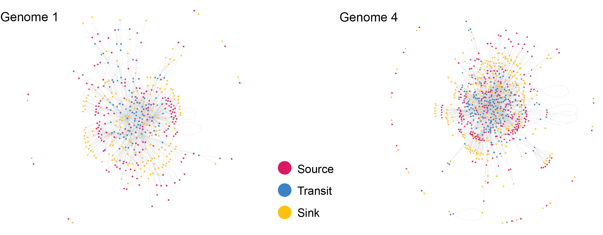

# MetaDEEP

MetaDEEP, the **Meta**bolic **D**ependence and **E**xchange **E**valuation **P**ackage, is an R package to analyse metabolic dependence and exchange metrics from genome-scale metabolic networks (GSMN).

## Installation

MetaDEEP can be installed from this Github repository using devtools.

```r
install.packages("devtools")
library(devtools)
install_github("anttonalberdi/metadeep")
library(metadeep)
```

### Dependencies

MetaDEEP only has three strict dependencies:

- [tidyverse](https://www.tidyverse.org)
- [SBMLR](https://www.bioconductor.org/packages/release/bioc/html/SBMLR.html)
- [igraph](https://igraph.org)

## Typical worflow

1. **sbml2rdb()** to load SBML files into a reaction database.
2. **rdb2igraph()** to generate genome-specific igraph network objects.
3. **rdb2gedb()** to generate a genome-metabolite database.
4. **gedb2medb()** to generate a metabolite-genome database.
5. **gedb2exdb()** to generate a metabolite exchange database.
6. **exdb2pair()** to transform metabolite exchange databases into pairwise matrices.
7. **pair2summary()** to calculate summary statistics of metabolite exchanges.
8. **pair2igraph()** to transform pairwise matrices into igraph network objects.
9. **donor()** to calculate genome-specific donor capacities.
10. **receptor()** to calculate genome-specific receptor capacities.

## Usage
Basic usage of MetaDEEP package

### Load a single SBML (sbml2rdb)
Load and convert a SBML file into MetaDEEP reaction database (rdb). The resulting object is a tibble containing character lists of reactants and products of each reaction. 

```r
# Read SBML directly into MetaDEEP reaction database (rdb)
genome1_rdb <- sbml2rdb("data/genome1.sbml")

# Read SBML in two steps into MetaDEEP reaction database (rdb)
genome1_rdb <- readSBML("data/genome1.sbml") %>% sbml2rdb()
```

| reaction                          | reactants    | products     |
|-----------------------------------|--------------|--------------|
| R_RXN__45__18707                  | <chr [2]>    | <chr [2]>    |
| R_RXN__45__14267                  | <chr [2]>    | <chr [2]>    |
| R_3__46__1__46__26__46__4__45__RXN| <chr [2]>    | <chr [2]>    |
| R_CARDIOLIPSYN__45__RXN           | <chr [1]>    | <chr [2]>    |

#### Explore a specific reaction

It is possible to visualise the metabolites involved in each reaction.

```r
genome1_rdb %>% 
    filter(reaction == "R_RXN__45__18707") %>% 
    unnest(cols = c(reactants, products))
```

| reaction         | reactants                                           | products                                      |
|------------------|-----------------------------------------------------|-----------------------------------------------|
| R_RXN__45__18707 | M_L__45__Cysteine__45__Desulfurase__45__persulfide_c | M_Cysteine__45__Desulfurase__45__L__45__cystei… |
| R_RXN__45__18707 | M_TusA__45__L__45__cysteine_c                       | M_TusA__45__Persulfides_c                    |

### Load multiple SBML (sbml2rdb)
Convert multiple SBML files into a list of MetaDEEP reaction databases (rdb). The resulting object is a list of tibbles containing character lists of reactants and products of each reaction. This step might take a few minutes (if working with hundreds of genomes) or even a few hours (if working with thousands of genomes) to accomplish. The resulting rdbs object can be considerably large (several GBs if working with thousands of genomes), which might require large memory allocation.

```r
sbml_files <- list.files(path = "data", pattern = "\\.sbml$", full.names = TRUE)
allgenomes_rdb <- sbml2rdb(sbml_files)
```

$genome1
| reaction                          | reactants    | products     |
|-----------------------------------|--------------|--------------|
| R_RXN__45__18707                  | <chr [2]>    | <chr [2]>    |
| R_RXN__45__14267                  | <chr [2]>    | <chr [2]>    |
| R_3__46__1__46__26__46__4__45__RXN| <chr [2]>    | <chr [2]>    |
| R_CARDIOLIPSYN__45__RXN           | <chr [1]>    | <chr [2]>    |

$genome2
| reaction                                 | reactants    | products     |
|------------------------------------------|--------------|--------------|
| R_THREOSPON__45__RXN                     | <chr [2]>    | <chr [2]>    |
| R_UDPNACETYLGLUCOSAMENOLPYRTRANS__45__RXN| <chr [2]>    | <chr [2]>    |
| R_RXN__45__22610                         | <chr [2]>    | <chr [2]>    |
| R_RXN__45__15920                         | <chr [2]>    | <chr [3]>    |

### Convert a reaction database into an igraph network (rdb2igraph)

```r
genome1_igraph <- rdb2igraph(genome1_rdb)
allgenomes_igraph <- rdb2igraph(allgenomes_rdb)
```

#### Visualise the network

```r
genome1_igraph %>%
  as.undirected() %>%
  plot(., 
        layout = layout_with_fr(genome1_igraph), 
        #vertex attributes
        vertex.color=V(genome1_igraph)$color,
        vertex.frame.color=NA,
        vertex.label=NA,
        vertex.size=1.5,
        #edge attributes
        edge.label = NA, 
        edge.curved = 0.1,
        edge.color="#cccccc70",
        edge.label.color="#8E8E1E"
        )
```



### Classify metabolite types into a genome database (rdb2gedb)
Classify metabolites in a single-genome (rdb) or multi-genome (rdbs) reaction database into source, transit and sink metabolites stored in a genome database (gedb).

- **Source metabolites:** those that the bacterium is able to use but not to produce.
- **Transit metabolites:** those that the bacterium is able to use and produce.
- **Sink metabolites:** those that the bacterium is able to produce but not to use.

#### In a single genome

```r
genome1_gedb <- rdb2gedb(genome1_rdb)
```

| genome  | sources    | transits   | sinks      | reactions | metabolites |
|---------|------------|------------|------------|-----------|-------------|
| genome1 | <chr [174]>| <chr [95]> | <chr [179]>| 267       | 448         |

#### In multiple genomes

```r
allgenomes_gedb <- rdb2gedb(allgenomes_rdb)
```

| genome  | sources    | transits   | sinks      | reactions | metabolites |
|---------|------------|------------|------------|-----------|-------------|
| genome1 | <chr [174]>| <chr [95]> | <chr [179]>| 267       | 448         |
| genome2 | <chr [442]>| <chr [407]>| <chr [441]>| 1011      | 1290        |
| genome3 | <chr [233]>| <chr [159]>| <chr [245]>| 395       | 637         |
| genome4 | <chr [262]>| <chr [196]>| <chr [282]>| 508       | 740         |

### Convert a genome database into a metabolite database (gedb2medb)
The genome database can be converted into a metabolite database to display the role each metabolite can play across genomes. The function also identifies the level of exchanging capacity depending on the role of the metabolite as source, transit or sink across different genomes.

```r
allgenomes_medb <- gedb2medb(allgenomes_gedb)
```

| metabolites                                                       | sinks       | transits | sources   | exchangable |
|-------------------------------------------------------------------|-------------|----------|-----------|-------------|
| M_10__45__FORMYL__45__DIHYDROFOLATE__45__GLU__45__N_c             | `<chr>`     | `<NULL>` | `<NULL>`  | no          |
| M_11Z__45__3__45__oxo__45__icos__45__11__45__enoyl__45__ACPs_c    | `<NULL>`    | `<chr>`  | `<NULL>`  | no          |
| M_11Z__45__icos__45__11__45__enoyl__45__ACPs_c                    | `<chr>`     | `<NULL>` | `<NULL>`  | no          |
| M_ACETYL__45__D__45__GLUCOSAMINYLDIPHOSPHO__45__UNDECAPRE_c       | `<chr [2]>` | `<NULL>` | `<chr [1]>` | strict      |
| M_AGMATHINE_c                                                      | `<NULL>`    | `<chr [1]>`| `<chr [1]>` | loose       |
| M_13__45__HYDROXY__45__MAGNESIUM__45__PROTOPORP_c                 | `<NULL>`    | `<chr>`  | `<NULL>`  | no          |
| M_16S__45__rRNA__45__2__45__O__45__methylcytidine1402_c           | `<chr>`     | `<NULL>` | `<NULL>`  | no          |
| M_CL__45___c                                                       | `<chr [1]>` | `<chr [1]>`| `<chr [1]>` | strict      |
| M_16S__45__rRNA__45__5__45__O__45__methylcytosine967_c            | `<chr>`     | `<NULL>` | `<NULL>`  | no          |
| M_CDPDIACYLGLYCEROL_c                                              | `<NULL>`    | `<chr [3]>`| `<chr [1]>` | loose       |

### Calculate metabolite exchange potential (gedb2exdb)

Calculate the capacity of each genome to provide or receive metabolites to/from other genomes. The resulting object is a tibble containing all pairwise combinations of genomes and their bi-directional as well as overall metabolite exchange capacities.

#### Strict mode 

In strict mode (default) only source and sink metabolites are considered for cross-feeding calculations. 

- **Forward:** sink metabolites of ***first*** that are source for ***second***
- **Reverse:** sink metabolites of ***second*** that are source for ***first***

```r
allgenomes_exdb <- gedb2exdb(allgenomes_gedb)
```

|  first   | second  | forward   | reverse   | total     |
|----------|---------|-----------|-----------|-----------|
| genome1  | genome2 | <chr [1]> | <chr [1]> | <chr [2]> |
| genome1  | genome3 | <chr [2]> | <chr [1]> | <chr [3]> |
| genome1  | genome4 | <chr [1]> | <chr [4]> | <chr [5]> |
| genome2  | genome3 | <chr [2]> | <chr [2]> | <chr [4]> |
| genome2  | genome4 | <chr [6]> | <chr [6]> | <chr [12]>|
| genome3  | genome4 | <chr [4]> | <chr [3]> | <chr [7]> |

#### Loose mode 

In loose mode source, transit and sink metabolites are considered for cross-feeding calculations.

- **Forward:** transit and sink metabolites of ***first*** that are source for ***second***
- **Reverse:** transit and sink metabolites of ***second*** that are source for ***first***

```r
allgenomes_exdb <- gedb2exdb(allgenomes_gedb, mode="loose")
```

|  first   | second  | forward    | reverse    | total      |
|----------|---------|------------|------------|------------|
| genome1  | genome2 | <chr [2]>  | <chr [3]>  | <chr [5]>  |
| genome1  | genome3 | <chr [5]>  | <chr [7]>  | <chr [12]> |
| genome1  | genome4 | <chr [7]>  | <chr [10]> | <chr [17]> |
| genome2  | genome3 | <chr [37]> | <chr [38]> | <chr [75]> |
| genome2  | genome4 | <chr [40]> | <chr [41]> | <chr [81]> |
| genome3  | genome4 | <chr [19]> | <chr [19]> | <chr [38]> |

### Convert cross-feeding database to exchange matrix

#### Total exchange

Number of total metabolites genomes in columns and rows can exchange with each other.

```r
allgenomes_pair_total <- exdb2pair(allgenomes_exdb, exchange="total")
```

| genomes | genome1 | genome2 | genome3 | genome4 |
|---------|---------|---------|---------|---------|
| genome1 | NA      | 2       | 3       | 5       |
| genome2 | NA      | NA      | 4       | 12      |
| genome3 | NA      | NA      | NA      | 7       |
| genome4 | NA      | NA      | NA      | NA      |

#### Forward exchange

Number of metabolites genomes in rows can provide to genomes in columns.

```r
allgenomes_pair_forward <- exdb2pair(allgenomes_exdb, exchange="forward")
```

| genomes | genome1 | genome2 | genome3 | genome4 |
|---------|---------|---------|---------|---------|
| genome1 | NA      | 1       | 2       | 1       |
| genome2 | NA      | NA      | 2       | 6       |
| genome3 | NA      | NA      | NA      | 4       |
| genome4 | NA      | NA      | NA      | NA      |

#### Reverse exchange

Number of metabolites genomes in rows can acquire from genomes in columns.

```r
allgenomes_pair_reverse <- exdb2pair(allgenomes_exdb, exchange="reverse")
```

| genomes | genome1 | genome2 | genome3 | genome4 |
|---------|---------|---------|---------|---------|
| genome1 | NA      | 1       | 1       | 4       |
| genome2 | NA      | NA      | 2       | 6       |
| genome3 | NA      | NA      | NA      | 3       |
| genome4 | NA      | NA      | NA      | NA      |

#### Relative abundance-normalised exchange

The relative abundances of microorganisms within a community can vary significantly. Consequently, it's improbable that a bacterium with a relative abundance of 0.00001 will sufficiently supply metabolites to one with 0.9 relative abundance. To address this, when relative abundance data is available, the exdb2pair() functions compute pairwise metabolite exchanges, taking into account the representation of bacteria. The output is a list containing a matrix for each sample, detailing these interactions.

```r
genome_abundances <- data.frame(genome=c("genome1","genome2","genome3","genome4"),
        sample1=c(0.25,0.25,0.25,0.25),
        sample2=c(0.40,0.40,0.10,0.10),
        sample3=c(0.85,0.05,0.05,0.05))
```

```r
allgenomes_pair_abun_total <- exdb2pair(allgenomes_exdb, exchange="total", abundance=genome_abundances)
```

**Sample 1**
|        | genome1 | genome2 | genome3 | genome4 |
|--------|---------|---------|---------|---------|
| genome1|   NA    |    2    |    3    |    5    |
| genome2|   NA    |   NA    |    4    |   12    |
| genome3|   NA    |   NA    |   NA    |    7    |
| genome4|   NA    |   NA    |   NA    |   NA    |

**Sample 2**
|        | genome1 | genome2 | genome3 | genome4 |
|--------|---------|---------|---------|---------|
| genome1|   NA    |    2    |   2.25  |    2    |
| genome2|   NA    |   NA    |   2.5   |   7.5   |
| genome3|   NA    |   NA    |   NA    |    7    |
| genome4|   NA    |   NA    |   NA    |   NA    |

**Sample 3**
|        | genome1 | genome2 | genome3 | genome4 |
|--------|---------|---------|---------|---------|
| genome1|   NA    | 1.0588  | 2.0588  | 1.2353  |
| genome2|   NA    |   NA    |    4    |   12    |
| genome3|   NA    |   NA    |   NA    |    7    |
| genome4|   NA    |   NA    |   NA    |   NA    |

If no exchange mode is defined, all three "forward", "reverse" and "total" exchanges are outputted. It is also possible to only select two of the modes with ***exchange=c("forward","reverse")***, for example.

```r
allgenomes_pair_abun_total <- exdb2pair(allgenomes_exdb, abundance=genome_abundances)
```

To fetch one of the exchange types from the nested list, one can make use of the map() and pluck() functions of ***purrr*** package.

```r
#Only list the forward matrices
map(allgenomes_pair_abun_total, pluck, "forward")
```

### Summarise pairwise matrices 

Pairwise matrices can be summarised into sample-specific metrics.

#### Single matrix with no abundance data

```r
pair2summary(allgenomes_pair_total)
```

| sum | median | mean | sd  |
|-----|--------|------|-----|
| 33  | 4.5    | 5.5  | 3.62|

#### List of matrices derived from abundance data

```r
pair2summary(allgenomes_pair_abun_total)
```

| sample  | sum  | median | mean | sd   |
|---------|------|--------|------|------|
| sample1 | 33.0 | 4.50   | 5.50 | 3.62 |
| sample2 | 23.2 | 2.38   | 3.88 | 2.63 |
| sample3 | 27.4 | 3.03   | 4.56 | 4.27 |

### Convert pairwise matrices to igraph network (pair2igraph)

#### Single matrices

```r
allgenomes_exchange_igraph_total <- pair2igraph(allgenomes_pair_total)

allgenomes_exchange_igraph_forward <- pair2igraph(allgenomes_pair_forward, mode="forward")

allgenomes_exchange_igraph_reverse <- pair2igraph(allgenomes_pair_reverse, mode="reverse")
```

The networks can be visualised:

```r
plot(allgenomes_exchange_igraph_total, 
      layout = layout_with_fr(allgenomes_exchange_igraph_total), 
      #vertex attributes
      vertex.color="#82CEC1",
      vertex.frame.color="#59AA9C",
      vertex.label.color="black",
      #edge attributes
      edge.label = E(allgenomes_exchange_igraph_total)$weight, 
      edge.width = E(allgenomes_exchange_igraph_total)$weight,
      edge.curved = 0.1,
      edge.color="#cccccc",
      edge.label.color="#8E8E1E",
      edge.arrow.size=1, 
      edge.arrow.width=1
      )
```


#### List of matrices

If pairwise metabolite exchange matrices have been generated for multiple samples, pair2igraph() can also handle lists, outputting another list of igraph objects. 

```r
pair2igraph(allgenomes_pair_abun_total)
```

Resulting in:

```
$sample1
IGRAPH af226c2 UNW- 4 6 -- 
+ attr: name (v/c), weight (e/n)
+ edges from af226c2 (vertex names):
[1] genome1--genome2 genome1--genome3 genome1--genome4 genome2--genome3 genome2--genome4 genome3--genome4

$sample2
IGRAPH f83027f UNW- 4 6 -- 
+ attr: name (v/c), weight (e/n)
+ edges from f83027f (vertex names):
[1] genome1--genome2 genome1--genome3 genome1--genome4 genome2--genome3 genome2--genome4 genome3--genome4

$sample3
IGRAPH cafa6e2 UNW- 4 6 -- 
+ attr: name (v/c), weight (e/n)
+ edges from cafa6e2 (vertex names):
[1] genome1--genome2 genome1--genome3 genome1--genome4 genome2--genome3 genome2--genome4 genome3--genome4
```

### Calculate donor and receptor potential (without abundances)

These calculations overlook relative abundances of bacteria, and only capture the theoretical capacity of metabolite exchange within the community.

#### Donor potential (donor)

Capacity of each bacterium to provide other bacteria with metabolites.

```r
allgenomes_donor <- exdb2focal(allgenomes_exdb, exchange="donor")
```

| genome  | metabolites | receptors_n | metabolites_n |
|---------|-------------|-------------|---------------|
| genome1 | <chr [4]>   |           3 |             4 |
| genome2 | <chr [8]>   |           3 |             8 |
| genome3 | <chr [7]>   |           3 |             7 |
| genome4 | <chr [10]>  |           3 |            10 |

#### Receptor potential (receptor)

Capacity of each bacterium to receive metabolites from other bacteria.

```r
allgenomes_receptor <- exdb2focal(allgenomes_exdb, exchange="receptor")
```

| genome  | metabolites | donors_n | metabolites_n |
|---------|-------------|----------|---------------|
| genome1 | <chr [6]>   |        3 |             6 |
| genome2 | <chr [8]>   |        3 |             8 |
| genome3 | <chr [7]>   |        3 |             7 |
| genome4 | <chr [9]>   |        3 |             9 |

### Calculate donor and receptor potential (with abundances)

The relative abundances of microorganisms often vary drastically within a community. Therefore it is unlikely that a bacterium with 0.00001 relative abundance will provide a bacterium with 0.9 relative abundance with metabolites. Therefore, if relative abundance data is provided, donor() and receptor() functions calculate metabolites exchanges considering the representation of bacteria.

```r
genome_abundances <- data.frame(genome=c("genome1","genome2","genome3","genome4"),
        sample1=c(0.25,0.25,0.25,0.25),
        sample2=c(0.40,0.40,0.10,0.10),
        sample3=c(0.85,0.05,0.05,0.05))
```

| genome  | sample1 | sample2 | sample3 |
|---------|---------|---------|---------|
| genome1 |   0.25  |   0.4   |   0.85  |
| genome2 |   0.25  |   0.4   |   0.05  |
| genome3 |   0.25  |   0.1   |   0.05  |
| genome4 |   0.25  |   0.1   |   0.05  |

#### Donor potential (exdb2focal, exchange="donor")

```r
allgenomes_donor <- exdb2focal(allgenomes_exdb, exchange="donor", abundance=genome_abundances)
```

| genome  | sample1 | sample2 | sample3 |
|---------|---------|---------|---------|
| genome1 |    4    |    4    |    4    |
| genome2 |   7.5   |    8    |   6.56  |
| genome3 |    7    |   4.75  |   6.06  |
| genome4 |   8.5   |   3.7   |   5.73  |

Note how in sample1, in which relative abundances of all bacteria are even, the donor potential is similar to the potential calculated without considering relative abundances. In the case of genome1 and genome3 the value is identical, because they only have one receptor per metabolite. In the case of genome2 and genome4 the value is lower because they have multiple receptors for some metabolites, which reduces their capacity to fully exchange metabolites.

The values in sample2 and sample3 are more different to the baseline donor potential, because relative abundances are very uneven. The bacteria with high relative abundances (genome1 and genome2 in sample2; genome1 in sample3) have a higher capacity to provide metabolites to other bacteria, because they are more abundant.

It is also possible to focus on a single genome using the ***focus*** argument. This is mainly useful when working with large quantities of genomes, to speed up computation.

```r
genome1_donor <- exdb2focal(allgenomes_exdb, exchange="donor", abundance=genome_abundances, focal="genome2")
```

| genome  | sample1 | sample2 | sample3 |
|---------|---------|---------|---------|
| genome2 |     7.5 |       8 |    6.56 |

#### Receptor potential (exdb2focal, exchange="receptor")

```r
allgenomes_receptor <- exdb2focal(allgenomes_exdb, exchange="receptor", abundance=genome_abundances)
```

| genome  | sample1 | sample2 | sample3 |
|---------|---------|---------|---------|
| genome1 |       6 |    2.25 |   0.353 |
| genome2 |       8 |       3 |       8 |
| genome3 |       7 |       7 |       7 |
| genome4 |       9 |       9 |       9 |


Note how in sample1, in which relative abundances of all bacteria are even, the receptor potential is similar to the potential calculated without considering relative abundances. In the case of genome1 and genome3 the value is identical, because they only have one donor per metabolite. In the case of genome2 and genome4 the value is higher because they have multiple donors for some metabolites, which increases their capacity to receive metabolites.

The values in sample2 and sample3 are rather different to the baseline receptor potential, because relative abundances are very uneven. The bacteria with high relative abundances (genome1 and genome2 in sample2; genome1 in sample3) have a much lower capacity to receive metabolites from other bacteria, because donors are much less abundant.
